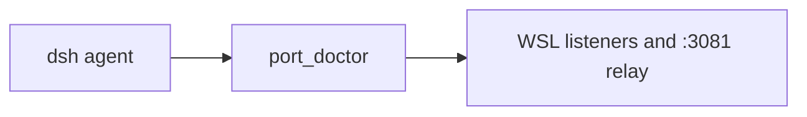

# dsh-wsl-port
> **Install set:** part of [dsh-wsl-kit](https://github.com/173787247/dsh-wsl-kit). Prefer `KIT_SET=daily` | `llm` | `github` | `full` (see kit README). Fault tree: [TROUBLESHOOTING.md](https://github.com/173787247/dsh-wsl-kit/blob/master/docs/TROUBLESHOOTING.md).


DeepSeek Harness tool: **`port_doctor`** — report WSL IPs and whether a TCP port is listening; advise on Windows **localhost forwarding**.

Part of **[dsh-wsl-kit](https://github.com/173787247/dsh-wsl-kit)**.

[中文说明 → README.zh.md](./README.zh.md)

## Where it sits

Diagnoses which process owns a WSL port. The Windows chat URL is :3081/?token=, not bare :3080.



Suite diagram and version snapshot: [dsh-wsl-kit](https://github.com/173787247/dsh-wsl-kit#how-the-pieces-fit). This plugin is **0.2.2** (full; also in llm). Do not copy that matrix into this README.


---
## Compatibility

| Field | Value |
|-------|-------|
| **Plugin** | `dsh-wsl-port` **0.2.2** |
| **Minimum dsh** | ≥ **0.1.2** (web UI one-shot `?token=` on Windows relay `:3081`) |
| **Latest verified** | See [dsh-wsl-kit Compatibility](https://github.com/173787247/dsh-wsl-kit#compatibility-2026-09) (currently **`0.1.7-alpha.2`**) — single source of truth for the suite |
| **Kit set** | `llm` / `full` (some also useful alone) |
| **Cloud Flash** | Use model id **`deepseek-flash`** (V4.1 Flash) in `~/.dsh/settings.yaml` / `llm-deepseek` — not configured by this plugin |
| **Agent Teams** | Upstream experimental; not required here |

Suite floor versions: kit [`check-plugin-versions.sh`](https://github.com/173787247/dsh-wsl-kit/blob/master/scripts/check-plugin-versions.sh). Fault tree: [TROUBLESHOOTING.md](https://github.com/173787247/dsh-wsl-kit/blob/master/docs/TROUBLESHOOTING.md).

**Scope:** `port_doctor` for listen state + Windows localhost tips. For dsh UI use **3080** (WSL) and relay **3081** (Windows) with launch `?token=` (dsh ≥0.1.2). Do not bind `dsh web --host 0.0.0.0`.

## Why

A server bound in WSL may be reachable as `http://127.0.0.1:<port>` from Windows—or may need the WSL eth IP / a firewall fix / `wsl --shutdown`. This tool checks `hostname -I` and `ss` listen state.

Default port: **3080** (common `dsh web` port). Override with the `port` argument.

### dsh UI ports (3080 vs 3081)

| Port | Where | Role |
|------|-------|------|
| **3080** | WSL `127.0.0.1` | `dsh web` itself — do not open from Windows unless mirrored |
| **3081** | Windows relay | Browser entry; needs `?token=` on dsh ≥0.1.2 |

Ask for `port_doctor` on **both** when the UI is blank / `ERR_CONNECTION_*`. Prefer kit `restart-dsh-web.sh` + [`check-dsh-health.sh`](https://github.com/173787247/dsh-wsl-kit/blob/master/scripts/check-dsh-health.sh) before inventing `netsh` rules. For LAN exposure see [dsh-wsl-expose](https://github.com/173787247/dsh-wsl-expose) — not for local chat UI.

## Install

```sh
dsh plugin --profile web add github:173787247/dsh-wsl-port
```

## Config

```yaml
- id: dsh-wsl-port
  name: dsh-wsl-port
  config:
    timeoutMs: 15000
    defaultPort: 3080
```

## Test

```sh
npm test
```

## License

MIT
