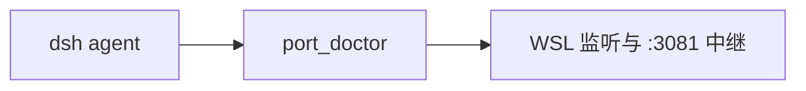

# dsh-wsl-port
> **套件安装：** 见 [dsh-wsl-kit](https://github.com/173787247/dsh-wsl-kit)。推荐 `KIT_SET=daily` | `llm` | `github` | `full`。故障树：[TROUBLESHOOTING.zh.md](https://github.com/173787247/dsh-wsl-kit/blob/master/docs/TROUBLESHOOTING.zh.md)。


DeepSeek Harness 工具：**`port_doctor`** — 报告 WSL IP、TCP 端口是否在听，并就 Windows **localhost 转发**给出建议。

属于 **[dsh-wsl-kit](https://github.com/173787247/dsh-wsl-kit)**。

[English → README.md](./README.md)

## 在套件里的位置

诊断 WSL 端口被谁占用。Windows 聊天地址是 :3081/?token=，不是裸 :3080。



整套关系图和版本快照：[dsh-wsl-kit 中文说明](https://github.com/173787247/dsh-wsl-kit/blob/master/README.zh.md)。本插件是 **0.2.2**（full，也在 llm）。不要把那份总表抄进本 README。


---
## 兼容性

| 项 | 值 |
|----|----|
| **插件** | `dsh-wsl-port` **0.2.2** |
| **最低 dsh** | ≥ **0.1.2**（Windows 中继 `:3081` 一次性 `?token=`） |
| **最新验证** | 以 [dsh-wsl-kit 兼容性](https://github.com/173787247/dsh-wsl-kit#compatibility-2026-09) 为准（当前 **`0.1.5-rc.1`**）— 套件唯一真源 |
| **套件档位** | `llm` / `full`（也可单独装） |
| **云端 Flash** | settings / `llm-deepseek` 使用 **`deepseek-flash`**（V4.1 Flash）；本插件不配置模型 id |
| **Agent Teams** | 上游实验包；本插件不依赖 |

套件版本地板：[`check-plugin-versions.sh`](https://github.com/173787247/dsh-wsl-kit/blob/master/scripts/check-plugin-versions.sh)。故障树：[TROUBLESHOOTING.zh.md](https://github.com/173787247/dsh-wsl-kit/blob/master/docs/TROUBLESHOOTING.zh.md)。

**范围：** `port_doctor` 看监听与 Windows localhost 提示。dsh UI：WSL **3080** + Windows 中继 **3081** + 启动 `?token=`（dsh ≥0.1.2）。不要 `dsh web --host 0.0.0.0`。

## 为什么需要

WSL 里绑定的服务，Windows 有时能用 `http://127.0.0.1:<port>` 打开，有时则需要 WSL 网卡 IP / 防火墙调整 / `wsl --shutdown`。本工具检查 `hostname -I` 与 `ss` 监听状态。

默认端口：**3080**（常见 `dsh web` 端口）。可用参数 `port` 覆盖。

### dsh UI 端口（3080 vs 3081）

| 端口 | 位置 | 作用 |
|------|------|------|
| **3080** | WSL `127.0.0.1` | `dsh web` 本体 — Windows 勿直接当入口（除非已 mirrored） |
| **3081** | Windows 中继 | 浏览器入口；dsh ≥0.1.2 需要 `?token=` |

UI 空白 / `ERR_CONNECTION_*` 时对**两端**跑 `port_doctor`。先用套件 `restart-dsh-web.sh` + [`check-dsh-health.sh`](https://github.com/173787247/dsh-wsl-kit/blob/master/scripts/check-dsh-health.sh)，再考虑 `netsh`。局域网暴露见 [dsh-wsl-expose](https://github.com/173787247/dsh-wsl-expose) — 不要用来解决本机聊天 UI。

## 安装

```sh
dsh plugin --profile web add github:173787247/dsh-wsl-port
```

## 配置

```yaml
- id: dsh-wsl-port
  name: dsh-wsl-port
  config:
    timeoutMs: 15000
    defaultPort: 3080
```

## 测试

```sh
npm test
```

## 许可

MIT
